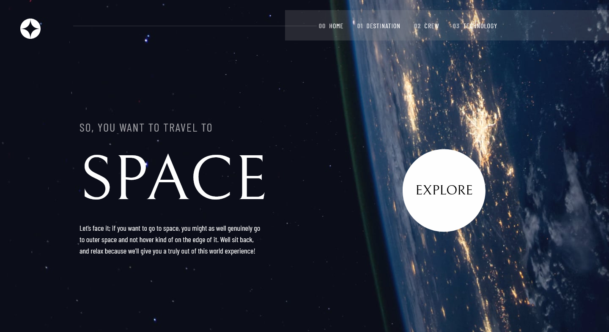

# Frontend Mentor - Space Tourism page solution

This is a solution to the [E-commerce product page challenge on Frontend Mentor](https://www.frontendmentor.io/challenges/space-tourism-multipage-website-gRWj1URZ3/hub). Frontend Mentor challenges help you improve your coding skills by building realistic projects.

## Table of contents

- [Overview](#overview)
  - [The challenge](#the-challenge)
  - [Screenshot](#screenshot)
  - [Links](#links)
- [My process](#my-process)
  - [Built with](#built-with)
  - [What I learned](#what-i-learned)
  - [Continued development](#continued-development)
- [Author](#author)

## Overview

### Disclaimer

This is still a work in progress so for now you will have a better experience viewing the site on a desktop screen

### The challenge

Users are able to:

- View each page and be able to toggle between the tabs to see new information
- Scroll through each item usign the mouse

### Screenshot



### Links

- Live Site URL: [Here](https://heiderick13.github.io/space-tourism/)

## My process

### Built with

- CSS custom properties
- Flexbox
- Vanilla JavaScript
- [Bootstrap](https://getbootstrap.com/) - For styles and layout

### What I learned

How to build a simple yet functional and stylish carousel using vanilla JavaScript

```js
const items = document.querySelectorAll(".item");
const controls = document.querySelectorAll(".control");
const maxItems = items.length;

let currentItem = 0;

controls.forEach((control) => {
  control.addEventListener("click", () => {
    const isLeft = control.classList.contains("left");

    console.log(control, currentItem, isLeft);

    if (isLeft) {
      currentItem--;
    } else {
      currentItem++;
    }

    if (currentItem >= maxItems) {
      currentItem = 0;
    }

    if (currentItem < 0) {
      currentItem = maxItems - 1;
    }

    items[currentItem].scrollIntoView({
      inline: "center",
      behavior: "smooth",
    });
  });
});
```

### Continued development

I intend to add responsive functionality to the website making it easy to navigate in any screen size.

## Author

- Website - [Marcelo Oliveira](www.linkedin.com/in/marcelo-ferreira-de-oliveira)
- Frontend Mentor - [@heiderick13](https://www.frontendmentor.io/profile/heiderick13)
- Github - [@heiderick13](https://github.com/heiderick13)
